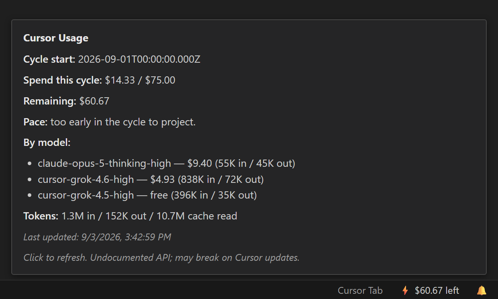
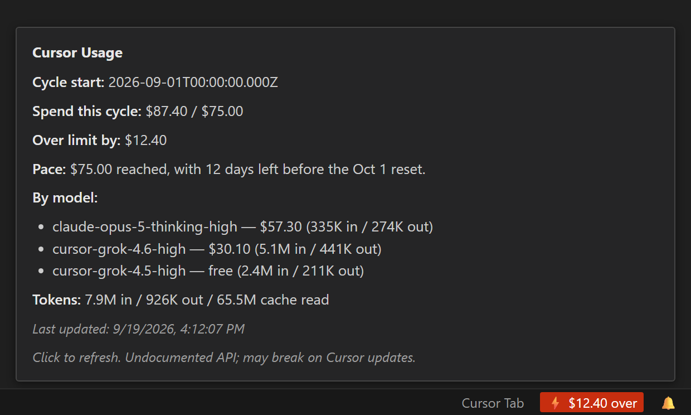

# Cursor Usage Status

Unofficial [Cursor](https://cursor.com) extension for VS Code–compatible editors. It shows your **token-based plan spend** against your **monthly limit** in the **status bar**.

**Important:** Cursor does not publish a stable third-party usage API. This extension reads your local Cursor sign-in token from SQLite and calls Cursor-hosted HTTPS endpoints. **Those endpoints or response shapes can change at any time** and break the extension — as they did in August 2026, when Cursor replaced request quotas with token pricing and deleted the routes this extension previously depended on. This project is not affiliated with or endorsed by Cursor.

## Demo

Spend against your monthly limit, with the per-model breakdown and pace projection in the tooltip:



Past the limit, the status bar names the overage rather than pinning at "$0 left":



> Rendered examples, not screenshots. The text is produced by the extension's own formatting code against a live account; the over-limit figures scale a real usage mix past the cap to show that state. Team, Business and Enterprise all render identically — they resolve through the same spend path.

## How usage is resolved

Cursor bills by **token spend** against a per-user monthly dollar cap. The extension makes three calls against your configured **`apiBaseUrl`** (default `https://api2.cursor.sh`) per refresh:

| Value | Source | Field |
| --- | --- | --- |
| Spend this cycle | `POST /aiserver.v1.DashboardService/GetAggregatedUsageEvents` | `totalCostCents`, `aggregations[]` |
| Per-user monthly limit | `POST /aiserver.v1.DashboardService/GetHardLimit` | `perUserMonthlyLimitDollars` |
| Billing cycle start | `GET /auth/usage` | `startOfMonth` |

`GetHardLimit` only returns `perUserMonthlyLimitDollars` when a **team id** is sent. The extension reads that id from Cursor's local database (`cursorAuth/cachedTeam`) — there is nothing to configure.

`totalCostCents` is the sum of each usage event's `chargedCents`, so it is **already net of any enterprise discount** and **already excludes free-credit usage**. The date range is sent explicitly rather than relying on the server's undocumented empty-body default.

### Why the status bar can lead the Cursor dashboard

Cursor's dashboard header ("Your monthly usage") is driven by a separate `overallSpendCents` counter that is **rounded to whole cents and materialized on a delay** — observed at `70` while live spend was `76.73`, catching up to `77` about ten minutes later. This extension reads the live figure instead, so it may briefly show slightly *more* than the dashboard header. The dashboard's own "Total usage" tile matches what the extension shows.

Reading `overallSpendCents` directly would require `GetTeamSpend`, whose response contains **every team member's name and email address** with no server-side filter to a single user. The extension deliberately does not call it.

## Features

- **Status bar:** remaining spend (e.g. **$74.23 left**), with `fraction` and `compact` alternatives.
- **Over-limit is explicit:** shows **$12.40 over** with a critical background rather than pinning at "$0 left".
- **Tooltip:** cycle start, spend vs limit, pace projection, per-model breakdown with token counts, and cycle token totals.
- **Pace projection:** extrapolates your current spend rate to the day the allowance runs out, and notifies you when that lands before the cycle resets.
- **Free-credit usage is labelled,** not hidden — models running on team credit grants report tokens but no cost, and appear as `cursor-grok-4.5-high — free (297K in / 19K out)`.
- Background polling (default 5 minutes, minimum 60 seconds).
- Commands: **Cursor Usage: Refresh** and **Cursor Usage: Show Details**.
- **Enterprise / proxy:** set `cursorUsageStatusbar.apiBaseUrl` to your approved `https://` origin; the bearer token is only ever sent to URLs under that origin.

## Pace projection

The extension extrapolates your spend rate over the elapsed part of the cycle to estimate when the allowance runs out, and grades how early that lands as a share of the cycle that would still remain:

| Step | Meaning |
| --- | --- |
| 0 | On pace — the allowance lasts through the reset. |
| 1 | Runs out before the reset, with under a quarter of the cycle left. |
| 2 | A quarter or more of the cycle would still remain. |
| 3 | Half or more of the cycle would still remain. |

**Notifications fire only on escalation.** The first off-pace poll of a cycle notifies; an unchanged or improving projection stays silent, and the high-water mark is never lowered within a cycle, so a projection hovering around a threshold cannot nag on every poll. **Dismiss for this cycle** silences it until the next billing period, which re-arms automatically. Turn the whole thing off with `paceNotifications`.

Projections are suppressed until at least **15% of the cycle has elapsed** *and* **5% of the limit has been spent** — a rate extrapolated from the first hours of a cycle, or from a few cents, predicts nothing. Until then the tooltip says it is too early to project.

Cycle length comes from the reported cycle start plus one month (with month-end clamping, so Jan 31 maps to Feb 28 or 29). Cursor cycles are not reliably calendar-aligned — the 2026-08-24 pricing change produced a short Aug 24 – Sep 1 cycle — so an end date reported by the API always takes precedence when one is available.

## Requirements

- **Cursor** (or a compatible build) with an active session (signed in).
- Local database path used by Cursor:
  - Windows: `%APPDATA%\Cursor\User\globalStorage\state.vscdb`
  - macOS: `~/Library/Application Support/Cursor/User/globalStorage/state.vscdb`
  - Linux: `~/.config/Cursor/User/globalStorage/state.vscdb`

## Plan support

| Plan | Status |
| --- | --- |
| **Team / Business / Enterprise** | Verified against a live account. Spend and per-user limit both resolve. |
| **Individual / Pro** | **Untested.** Without a team id, Cursor reports no per-user limit, so the status bar shows spend only (e.g. **$4.68 used**) with no color thresholds. Set `manualMonthlyLimitDollars` to get a limit, remaining figure, and warning colors. |

## Configuration

All settings are under `cursorUsageStatusbar.*`:

| Setting | Default | Description |
| --- | --- | --- |
| `apiBaseUrl` | `https://api2.cursor.sh` | HTTPS origin for all usage API calls. |
| `pollIntervalSeconds` | `300` | Refresh interval (minimum `60`). |
| `displayFormat` | `remaining` | `remaining`, `fraction`, or `compact`. All show USD. |
| `manualMonthlyLimitDollars` | `0` | Fallback monthly limit in USD when Cursor reports none. Ignored when a team limit is available. |
| `paceNotifications` | `true` | Notify when spend is projected to exhaust the limit before the cycle resets. |
| `warningRemainingPercent` | `20` | Warning color when remaining ≤ this % of limit. |
| `criticalRemainingPercent` | `10` | Critical color when remaining ≤ this % of limit. |
| `includedModelKey` | — | **Deprecated and ignored.** Request quotas no longer exist. |

## Security notes

- The access token is read from disk on each refresh and **not stored** by the extension.
- The token is sent **only over HTTPS** to the configured **`apiBaseUrl` origin** (enforced for every GET and POST).
- The extension does not call any endpoint that returns other team members' personal data.
- Errors are kept generic so tokens and local paths are not leaked in UI messages.

## Development

Requires **Node 20.19+ or 22+**. The build toolchain (`@vscode/vsce` via `undici`, and `mocha` 12) declares `node >=20.18.1`; on Node 18 `vsce package` fails with `ReferenceError: File is not defined`.

```bash
npm install
npm run compile
npm test
```

`npm test` and `vscode:prepublish` both run `npm run clean` first. `tsc` does not remove outputs for deleted sources, and `out/` is gitignored — without the clean step, orphaned build artifacts silently keep running in the test suite and shipping in the VSIX.

Press **F5** in this folder to launch the Extension Development Host (uses the default **Run Extension** configuration).

## Packaging

```bash
npm install -g @vscode/vsce
npm run compile
npx vsce package
```

Install the generated `.vsix` via **Extensions: Install from VSIX…** in Cursor.

### Open VSX (Cursor marketplace)

Cursor surfaces extensions from [Open VSX](https://open-vsx.org). To publish:

1. Create an access token at Open VSX.
2. Use `npx ovsx publish -p <token>` (after `vsce package` or from the packaged extension per Open VSX docs).

Update `publisher` in `package.json` to your Open VSX namespace before publishing.

## License

MIT. The full license text is included in the extension package as `LICENSE`.
