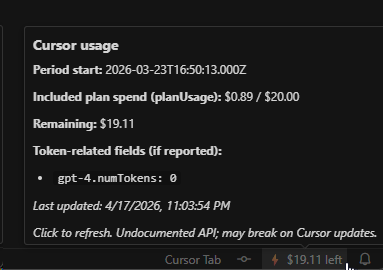
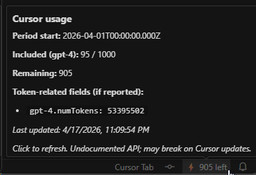

# Cursor Usage Status

Unofficial [Cursor](https://cursor.com) extension for VS Code–compatible editors. It shows **included plan usage** in the **status bar** (remaining allowance when the API returns it), with optional on-demand and token hints from secondary responses.

**Important:** Cursor does not publish a stable third-party usage API. This extension reads your local Cursor sign-in token from SQLite and calls Cursor-hosted HTTPS endpoints. **Those endpoints or response shapes can change at any time** and break the extension. This project is not affiliated with or endorsed by Cursor.

## Demo

Team/Pro Usage:



Enterprise Usage:



## How usage is resolved (by plan type)

The extension calls several endpoints on your configured **`apiBaseUrl`** (default `https://api2.cursor.sh`) and **merges** the results. What you see depends on your account:

| Plan | Primary source | What the status bar shows |
| --- | --- | --- |
| **Pro / Team / Ultra** | Connect RPC **`GetCurrentPeriodUsage`** (`planUsage`: spend in **USD cents** toward your included allowance) | Dollar-style remaining included spend (e.g. **$123.45 left**), unless your locale formats currency differently. |
| **Enterprise** (request-based quota) | **`GET /auth/usage`** (per-model buckets such as `numRequests` / `maxRequestUsage`) | Remaining **included requests** for the preferred model bucket (see `includedModelKey`). |

- **`GET /api/usage/summary`** is merged when present (on-demand spend hints and extra fields).
- **Dashboard wins for “included” quota:** if `GetCurrentPeriodUsage` returns usable `planUsage`, it overrides empty or incompatible shapes from `/auth/usage` (which is why Team/Pro work alongside Enterprise-style responses).

Undocumented behavior; Cursor may change field names or routes without notice.

## Features

- **Pro / Team / Ultra:** status bar and tooltip for **included plan spend** (cents from API, displayed as money).
- **Enterprise:** status bar for **monthly included requests** per model bucket (configurable preferred key).
- Tooltip: billing period start, used/limit (or spend), optional on-demand lines, team **spend limit** pool hints when returned, and token-related keys when present.
- Background polling (default 5 minutes, minimum 60 seconds).
- Commands: **Cursor Usage: Refresh** and **Cursor Usage: Show Details**.
- **Enterprise / proxy:** set `cursorUsageStatusbar.apiBaseUrl` to your approved `https://` API origin; the extension only sends your bearer token to URLs under that origin (same checks for GET and POST paths below).

### Endpoints used (same origin only)

Relative to `apiBaseUrl`:

- `POST /aiserver.v1.DashboardService/GetCurrentPeriodUsage` — Connect-style JSON body `{}`, headers `Content-Type: application/json` and `Connect-Protocol-Version: 1` (Pro/Team/Ultra `planUsage`).
- `GET /auth/usage` — legacy included usage / model buckets (often Enterprise).
- `GET /api/usage/summary` — optional summary and on-demand hints.

## Requirements

- **Cursor** (or a compatible build) with an active session (signed in).
- Local database path used by Cursor:
  - Windows: `%APPDATA%\Cursor\User\globalStorage\state.vscdb`
  - macOS: `~/Library/Application Support/Cursor/User/globalStorage/state.vscdb`
  - Linux: `~/.config/Cursor/User/globalStorage/state.vscdb`

## Configuration

All settings are under `cursorUsageStatusbar.*`:

| Setting | Default | Description |
| --- | --- | --- |
| `apiBaseUrl` | `https://api2.cursor.sh` | HTTPS origin for all usage API calls (must allow the GET and POST paths listed above if you use a proxy). |
| `pollIntervalSeconds` | `300` | Refresh interval (minimum `60`). |
| `displayFormat` | `remaining` | `remaining`, `fraction`, or `compact` (for **cents** plans, values are formatted as **currency**; for **request** plans, as counts). |
| `includedModelKey` | `gpt-4` | Preferred model bucket key when parsing **`/auth/usage`** (Enterprise-style JSON). Ignored when the dashboard response supplies `planUsage`. |
| `warningRemainingPercent` | `20` | Status bar warning color when remaining ≤ this % of limit. |
| `criticalRemainingPercent` | `10` | Status bar critical color when remaining ≤ this % of limit. |

## Security notes

- The access token is read from disk on each refresh and **not stored** by the extension.
- The token is sent **only over HTTPS** to the configured **`apiBaseUrl` origin** (same-origin enforcement for the dashboard POST and the GET endpoints above).
- Errors are kept generic so tokens and local paths are not leaked in UI messages.

## Development

```bash
npm install
npm run compile
npm test
```

Press **F5** in this folder to launch the Extension Development Host (uses the default **Run Extension** configuration).

## Packaging

```bash
npm install -g @vscode/vsce
npm run compile
npx vsce package
```

Install the generated `.vsix` via **Extensions: Install from VSIX…** in Cursor.

### Open VSX (Cursor marketplace)

Cursor surfaces extensions from [Open VSX](https://open-vsx.org). To publish:

1. Create an access token at Open VSX.
2. Use `npx ovsx publish -p <token>` (after `vsce package` or from the packaged extension per Open VSX docs).

Update `publisher` in `package.json` to your Open VSX namespace before publishing.

## License

MIT. The full license text is included in the extension package as `LICENSE`.
